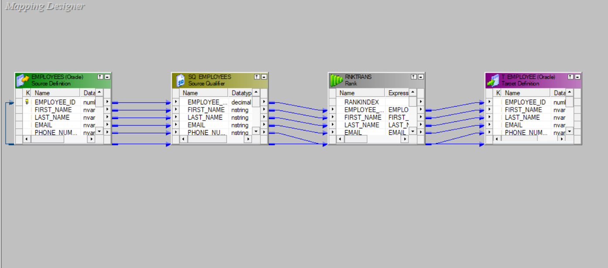

## Rank Transformation — Interview Cheat Sheet

### Overview
- **What it is**: Active transformation that selects top or bottom ranked data based on a ranking condition.
- **When to use**: Get top N records, bottom N records, or records within a specific rank range (e.g., top 10 salespeople, bottom 5 performers).

### Key Features
- **Active**: Can change the number of output rows (filters based on rank).
- **Blocking**: Must cache all input data to determine rankings before outputting results.
- **Ranking**: Assigns rank numbers based on specified ranking ports and conditions.
- **Flexible output**: Can output top N, bottom N, or specific rank ranges.

### Types of Ranking

#### 1. Top Ranking
- **Purpose**: Select highest values (e.g., top 10 salaries)
- **Example**: Top 5 employees by salary in each department
- **Configuration**: Set "Top" and specify number of records

#### 2. Bottom Ranking
- **Purpose**: Select lowest values (e.g., bottom 5 performers)
- **Example**: Bottom 3 products by sales volume
- **Configuration**: Set "Bottom" and specify number of records

#### 3. Dense Rank vs. Rank
- **Dense Rank**: No gaps in ranking (1,2,2,3,4)
- **Standard Rank**: Gaps after ties (1,2,2,4,5)
- **Example**: If two employees have same salary, dense rank continues 1,2,2,3 vs. standard rank 1,2,2,4

### Key Properties

#### Ranking Ports
- **Group By Ports**: Define groups for ranking (e.g., department_id for ranking within departments)
- **Ranking Port**: The column to rank by (e.g., salary, sales_amount)
- **Rank Index Port**: Output port that contains the actual rank number

#### Configuration Options
- **Number of Ranks**: How many top/bottom records to return
- **Top/Bottom**: Direction of ranking
- **Cache Directory**: Location for temporary cache files
- **Tracing Level**: Session log verbosity

### Common Use Cases

#### 1. Top Performers Analysis
- **Scenario**: Find top 10 salespeople by revenue
- **Setup**: Rank on sales_amount (descending), return top 10
- **Business Value**: Identify high performers for rewards/recognition

#### 2. Department-wise Rankings
- **Scenario**: Top 3 employees by salary in each department
- **Setup**: Group by department_id, rank on salary, return top 3
- **Business Value**: Fair comparison within departments

#### 3. Product Performance
- **Scenario**: Bottom 5 products by sales volume
- **Setup**: Rank on sales_volume (ascending), return bottom 5
- **Business Value**: Identify underperforming products for review

#### 4. Time-based Rankings
- **Scenario**: Most recent 5 orders per customer
- **Setup**: Group by customer_id, rank on order_date (descending), return top 5
- **Business Value**: Customer behavior analysis

### Performance Tips

#### Cache Optimization
- **Cache Size**: Increase cache size for large datasets in session properties
- **Cache Directory**: Use fast disk/SSD for cache files
- **Memory**: Ensure sufficient memory for caching all input data

#### Design Optimization
- **Filter Early**: Use upstream filters to reduce data before ranking
- **Appropriate Grouping**: Only group by necessary columns
- **Index Cache**: Enable if repeatedly ranking same dataset
- **Partitioning**: Partition by group-by columns when possible

### Rank vs. Other Transformations

#### Rank vs. Aggregator
- **Rank**: Returns actual records with rankings
- **Aggregator**: Returns summary statistics (MIN, MAX, etc.)
- **Use Case**: Rank for "who are the top performers", Aggregator for "what is the highest salary"

#### Rank vs. Sorter + Filter
- **Rank**: Built-in ranking logic, handles ties properly
- **Sorter + Filter**: More complex setup, may not handle ties correctly
- **Performance**: Rank is optimized for ranking operations

#### Rank vs. SQL Window Functions
- **Rank**: Informatica-based, works with any source
- **SQL**: Database-based, potentially faster for single DB sources
- **Flexibility**: Rank works in complex multi-source scenarios

### Common Patterns

#### Pattern 1: Top N per Group
```
Source → Rank (Group by DEPT_ID, Rank on SALARY DESC, Top 3) → Target
Result: Top 3 highest-paid employees per department
```

#### Pattern 2: Latest Records per Key
```
Source → Rank (Group by CUSTOMER_ID, Rank on ORDER_DATE DESC, Top 1) → Target
Result: Most recent order for each customer
```

#### Pattern 3: Percentile Analysis
```
Source → Rank (Rank on SCORE, return top 10%) → Target
Result: Top 10% performers based on score
```


### Best Practices

#### Design Best Practices
- **Clear Ranking Criteria**: Define ranking logic clearly with business users
- **Handle NULLs**: Decide how NULL values should be ranked
- **Secondary Sort**: Use multiple ranking criteria for consistent results
- **Group Appropriately**: Only group by dimensions that make business sense

#### Performance Best Practices
- **Cache Tuning**: Monitor cache usage and adjust sizes accordingly
- **Early Filtering**: Filter unnecessary data before ranking
- **Partition Strategy**: Align partitions with group-by columns
- **Monitor Memory**: Watch for memory pressure during ranking operations


---

### Project Screenshots

#### Rank on Salary Group by Department ID


#### Designer View


#### Workflow Monitor Results


#### Database Results

