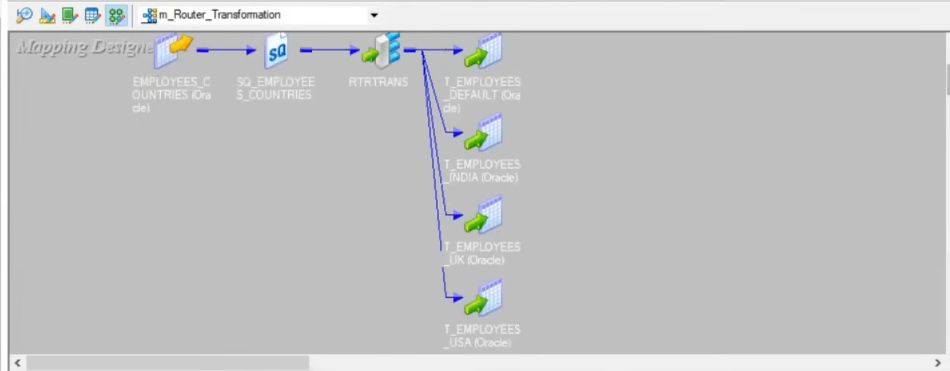

## Router Transformation 

### Overview
- **What it is**: Active transformation that routes rows to multiple output groups based on conditions. Think of it as multiple filters in one transformation.
- **When to use**: You need to split rows into different paths based on business rules (e.g., route by region, priority, status) instead of using multiple Filter transformations.

### Key concepts
- **Input Group**: Single input pipeline.
- **Output Groups**: Multiple conditional outputs + one optional Default Group.
- **Group Filter Conditions**: Each output group has a boolean condition; rows matching the condition go to that group.
- **Default Group**: Catches rows that don't match any other condition (like ELSE clause).

### How it works
- Router evaluates conditions **in order** (top to bottom).
- First matching condition wins; row goes to that group only.
- Same row can't go to multiple groups (unlike Union which combines).
- If no conditions match, row goes to Default Group (if exists) or gets dropped.

### Key properties
- **Group Filter Conditions**: Boolean expressions per output group.
- **Tracing Level**: Session log verbosity.
- **Order matters**: Conditions evaluated sequentially; put most specific first.

### Performance tips
- Order conditions by selectivity (most restrictive first) to minimize evaluations.
- Keep conditions simple; complex logic can slow row-by-row processing.
- Consider using variables in conditions for reusability.
- Router is non-blocking but evaluates all conditions per row.

### Common patterns
- **Route by region**: 
  - Group 1: `COUNTRY = 'USA'` → to USA processing
  - Group 2: `COUNTRY = 'UK'` → to UK processing  
  - Group 3: `COUNTRY = 'INDIA'` → to India processing
  - Default: other countries → to default processing

- **Route by business rules**:
  - High Priority: `AMOUNT > 10000` → immediate processing
  - Medium Priority: `AMOUNT BETWEEN 1000 AND 10000` → standard processing
  - Default: low amounts → batch processing

### Router vs. alternatives
- **Router vs. Filter**: Router splits into multiple paths; Filter is single pass/drop.
- **Router vs. multiple Filters**: Router is more efficient than separate Filter transformations for the same source.
- **Router vs. Expression + Filter**: Router handles the logic in one place; cleaner design.

### Interview one-liner
"Router is like a switch statement for data flows—it evaluates conditions in order and routes each row to the first matching output group, with an optional default for unmatched rows."

---

### Project Screenshots

#### Router on Values of Country

#### Designer View

#### Workflow Monitor Results

