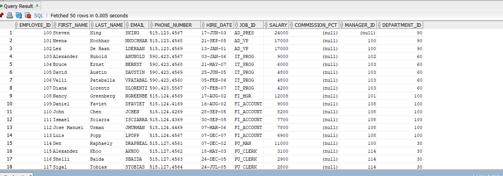
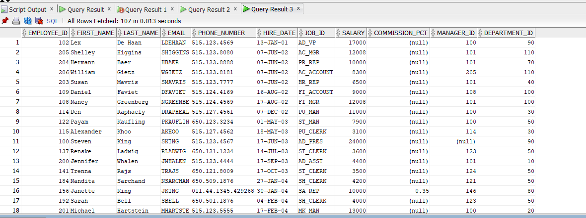
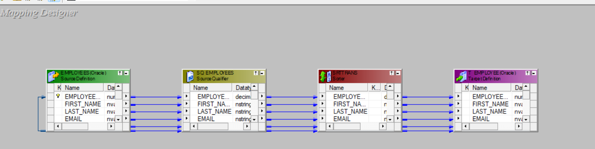

## Sorter Transformation 

### Overview
- **What it is**: Active, blocking transformation that sorts rows by one or more keys. Buffers input, sorts, then outputs.
- **When to use**: You need sorted data but cannot push `ORDER BY` to the source (non‑relational source or sort required after upstream logic like Joiner/Lookup/Expression).

### Key properties
- **Key Ports**: Mark ports as sort keys (on the Ports tab). The order top→bottom defines key precedence (key1, then key2…).
- **Sort Order**: Set per key to `Ascending` or `Descending`.
- **Distinct Output**: Removes duplicate rows based on the defined key set when enabled.
- **Case Sensitive**: If enabled, character comparison respects case when sorting.
- **Null Treated Low**: Treats NULLs as lower than any non‑NULL value when enabled.
- **Tracing Level**: Controls session log verbosity for this transformation.

### Performance tips
- Prefer database sorting via `Source Qualifier` (Number Of Sorted Ports / ORDER BY) when possible.
- Keep key set minimal; place the most selective key first.
- Align datatypes/lengths on keys to avoid implicit casts.
- Filter early to reduce the volume before sorting.
- Ensure sufficient Sorter cache (session setting) and fast temp disk to minimize spills.
- Be mindful that Sorter is blocking; it can increase latency and memory usage.

### Sorter vs. SQ sorting
- **Sorter**: Runs in DTM, blocking, uses Informatica memory/disk; works after upstream logic and with any source type.
- **SQ sorting**: Pushes sorting to the database (`ORDER BY`), leveraging indexes and the optimizer; usually faster and reduces DTM resource usage.

---

### Project Screenshots

#### Before Sorting

#### After Sorting

#### Sort on Hire Date and Salary Configuration

#### Designer View

