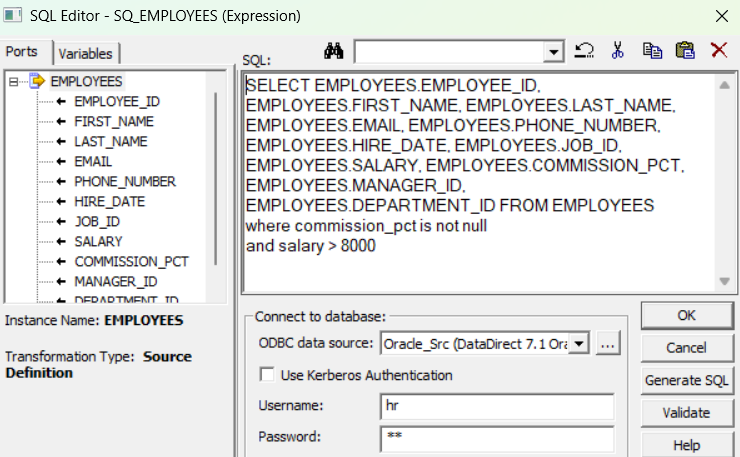
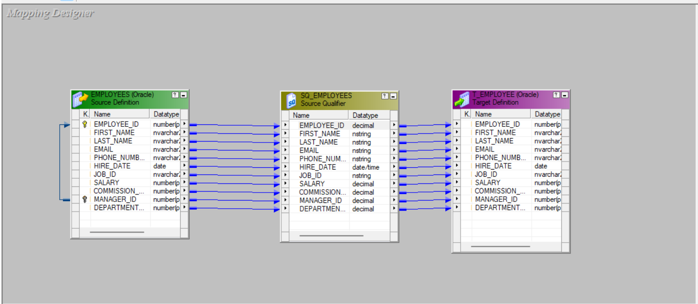

## Source Qualifier Transformation (SQ) 

### Overview
- **Purpose**: Interface between a source definition and the rest of the mapping. For relational sources, the SQ generates and runs the SELECT that reads the rows. For non‑relational sources, it represents the rows read by the Integration Service.
- **When it’s created**: Automatically added when you drag a source into a mapping (one SQ per database connection group).
- **Why it matters**: Pushing filters, joins, sorting, and distinct into the SQ lets the database do the heavy work—usually faster than separate transformations.

### Key properties 

- **Sql Query**
  - Overrides the auto‑generated SELECT entirely. When you use it, other SQL‑related properties (Source Filter, Select Distinct, Number Of Sorted Ports, User Defined Join) are effectively ignored.
  - Use only when you need complex SQL the SQ can’t express.

- **User Defined Join**
  - Adds a JOIN clause between two or more sources within the same SQ (same database connection).
  - Prefer this (or database joins) over a downstream Joiner when possible for performance.

- **Source Filter**
  - Appends a WHERE clause to limit rows at the source.
  - Faster than filtering later in a Filter transformation.

- **Number Of Sorted Ports**
  - Tells the SQ to ORDER BY the first N ports that are marked “sorted” on the Ports tab (relational sources only).
  - Lets the database sort instead of using a Sorter transformation.

- **Tracing Level**
  - Controls session log verbosity for this transformation: None, Terse, Normal, Verbose Initialization, Verbose Data.
  - Higher levels help debugging but slow the run and inflate logs.

- **Select Distinct**
  - Adds SELECT DISTINCT to remove duplicates at the database.
  - Use carefully—can be expensive on large sets without proper indexing.

- **Pre SQL**
  - SQL statement(s) executed on the source connection before the main SELECT (e.g., temp tables, session settings).
  - Runs once per connection/partition at session start.

- **Post SQL**
  - SQL statement(s) executed on the source connection after the main SELECT finishes (e.g., cleanup, stats gathering).

- **Output is deterministic**
  - Indicates the transformation always produces the same output for the same input.
  - Helps the engine with optimizations and partitioning assumptions.

- **Output is repeatable**
  - Indicates the row order is consistent across runs/partitions.
  - For most databases without ORDER BY, SQ output is not guaranteed repeatable—set this only if you truly guarantee stable order (e.g., ORDER BY on a unique key).

### Why pushing work into Source Qualifier (SQ) is faster

- **Leverages the database optimizer**: DBs do set-based operations (filters/joins/sorts/distinct) with advanced optimizers, indexes, and statistics. This is usually far more efficient than row-by-row processing in the Integration Service.
- **Reduces data movement**: Filter at source = fewer rows sent over the network and through the DTM. Less I/O → faster pipelines.
- **Lowers DTM memory/cpu usage**: Offloading Filter/Joiner/Sorter/Aggregator (DISTINCT) means fewer blocking/semi‑blocking transformations and smaller caches on the Integration Service.
- **Uses indexes and parallel DB execution**: WHERE + JOIN + ORDER BY can use bitmap/B-tree indexes, partition pruning, and intra-DB parallelism.

### Concrete examples

- **Filter**
  - Without SQ filter: read 100M rows → Filter transformation keeps 100k → 100M rows cross the network and DTM.
  - With SQ Source Filter: WHERE order_date >= sysdate-1 → DB returns only 100k rows. Huge cut in I/O and memory.

- **Join**
  - Downstream Joiner often needs sorting/caches (semi‑blocking).
  - SQ User Defined Join lets the DB join using indexes/hash joins; typically faster and no DTM cache pressure.

- **Sort**
  - Sorter transformation sorts in DTM memory and may spill to disk.
  - SQ Number Of Sorted Ports → DB ORDER BY can use indexes (already sorted) or optimized sort algorithms.

- **Distinct**
  - Select Distinct in SQ lets DB deduplicate (often via GROUP BY/unique index).
  - Doing it later requires Aggregator cache and is blocking.

### When not to push down
- Heterogeneous sources (can't be joined in one SQ/connection).
- Logic not expressible in SQL or requires Informatica-specific functions.
- DB is a bottleneck (you might balance some work in DTM).
- You need a non‑SQL transformation behavior.

### Practical tips
- Prefer `Source Filter`, `User Defined Join`, `Number Of Sorted Ports`, `Select Distinct` before adding `Filter/Joiner/Sorter/Aggregator`.
- Only override `Sql Query` if necessary; it disables those properties.
- Ensure sorted/unique keys if you rely on stable ordering.

---

### Project Screenshots

#### Pre SQL Configuration

#### Designer View

#### Workflow Monitor Results

#### Database Results

