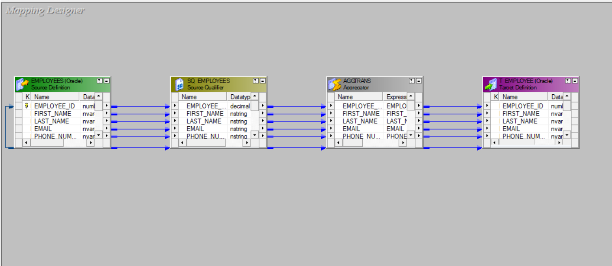
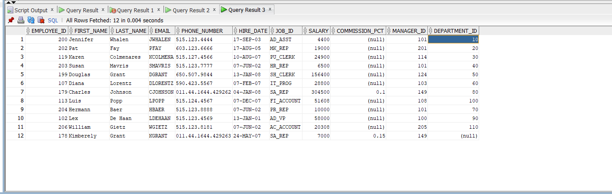

## Aggregator Transformation 

### Overview
- **What it is**: Active, blocking transformation that computes aggregates across all rows or per group (GROUP BY).
- **When to use**: Totals, averages, min/max, counts, dedup rules like "one row per key"; or when aggregation must happen after upstream logic (e.g., post-Joiner/Lookup/Expression).

### Key properties
- **Sorted Input**: If upstream data is sorted on all group-by keys, enable this to stream groups with far smaller cache and better speed.
- **Tracing Level**: Controls session log verbosity for this transformation.
- (Session-level) **Aggregator caches**: Uses data/index caches in memory/disk; size tuned in session properties.

### Ports and expressions
- **Group By ports**: Mark input ports as group keys on the Ports tab.
- **Aggregate expression ports**: Use functions like `SUM`, `AVG`, `MIN`, `MAX`, `COUNT`, `FIRST`, `LAST` (and expressions using these).
- **Variable ports**: Build intermediate expressions used by aggregate outputs.
- **Rules**: Any non-group input referenced in an output must be wrapped in an aggregate function.

### Performance tips
- Prefer DB aggregation when possible: push `GROUP BY` and aggregates via `Source Qualifier` (SQL override) for relational sources.
- Enable **Sorted Input** and sort upstream by the group keys (via `Sorter` or SQ `Number Of Sorted Ports`).
- Filter early; minimize group-by columns; align datatypes to avoid casts.
- Use **Incremental Aggregation** (session option) when loading deltas into a pre-aggregated target.
- Partition on group keys and co-partition streams when using session partitioning.

### Common patterns
- **Totals per customer**: Group By `customer_id`; outputs: `SUM(amount)`, `COUNT(*)`, `MAX(order_date)`.
- **Latest row per key**: Sort by `key ASC, date DESC` → Aggregator Group By `key` with `FIRST(date)`/`MAX(date)`; if you need the full record, join back to the detailed stream on `(key, date)`.
- **Dedup**: Sort on keys, enable Sorted Input, Group By keys; output one row per key (optionally add `MAX/MIN` to pick a rule).

### Aggregator vs alternatives
- **SQ GROUP BY (SQL)**: Fastest for relational sources (uses DB optimizer/indexes). Prefer when logic is expressible in SQL.
- **Sorter Distinct**: Removes exact duplicate rows by key; no computed measures. Aggregator is needed for sums/averages or rule-based dedup.

### Gotchas
- Aggregator is blocking; expect higher latency and cache usage on large groups.
- `COUNT(col)` ignores NULLs; align with your business logic.
- Ensure upstream sort truly covers all group keys before enabling Sorted Input.

---

### Project Screenshots

#### Sum on Salary Configuration

#### Designer View

#### After Aggregation Results

#### Workflow Monitor Results

