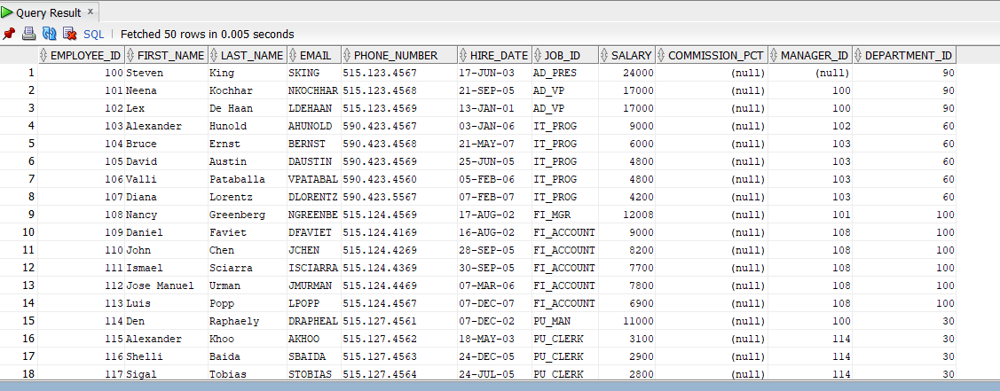
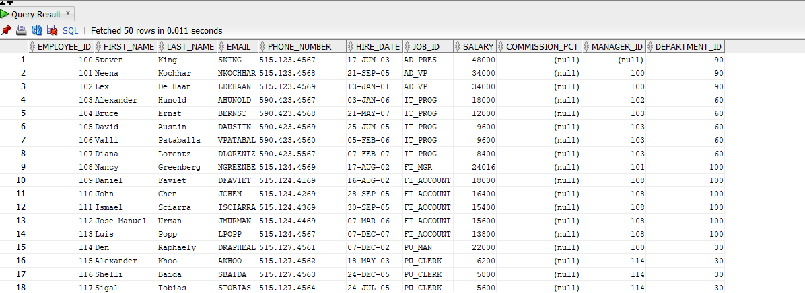
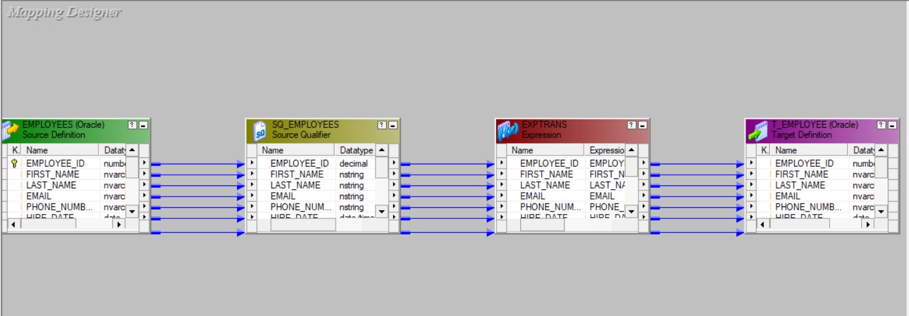

## Expression Transformation 

### Overview
- **What it is**: Passive transformation that performs calculations, data conversions, and string manipulations on a row-by-row basis.
- **When to use**: Clean data, derive new columns, apply business logic, format data, perform calculations that can't be done in Source Qualifier.

### Key Features
- **Passive**: Each input row produces exactly one output row (1:1 relationship).
- **Non-blocking**: Processes rows as they flow through the pipeline.
- **Row-level operations**: Works on individual rows, not aggregates.
- **Multiple outputs**: Can create multiple derived columns from single input.

### Types of Ports
- **Input Ports**: Receive data from upstream transformations.
- **Output Ports**: Send transformed data to downstream transformations.
- **Variable Ports**: Store intermediate calculations (not passed downstream).
- **Local Variables**: Used within the transformation for complex logic.

### Common Use Cases

#### 1. Data Cleansing
- **Trim spaces**: `LTRIM(RTRIM(FIRST_NAME))`
- **Handle NULLs**: `IIF(ISNULL(SALARY), 0, SALARY)`
- **Case conversion**: `UPPER(LAST_NAME)`, `LOWER(EMAIL)`
- **Remove special characters**: `REPLACECHR(0, PHONE_NUMBER, '-() ', '')`

#### 2. Data Calculations
- **Mathematical operations**: `SALARY * 12` (annual salary)
- **Date calculations**: `ADD_TO_DATE(HIRE_DATE, 'YY', 5)` (5 years later)
- **Percentage calculations**: `(SALES_AMOUNT / TOTAL_SALES) * 100`
- **Conditional calculations**: `IIF(DEPARTMENT = 'IT', SALARY * 1.1, SALARY)`

#### 3. Data Formatting
- **Date formatting**: `TO_CHAR(HIRE_DATE, 'YYYY-MM-DD')`
- **Number formatting**: `TO_CHAR(SALARY, '999,999.99')`
- **String concatenation**: `FIRST_NAME || ' ' || LAST_NAME`
- **Substring extraction**: `SUBSTR(EMAIL, 1, INSTR(EMAIL, '@') - 1)`

#### 4. Data Type Conversions
- **String to number**: `TO_INTEGER(EMPLOYEE_ID_STR)`
- **Number to string**: `TO_CHAR(SALARY)`
- **Date conversions**: `TO_DATE(DATE_STRING, 'MM/DD/YYYY')`

### Key Properties
- **Tracing Level**: Controls session log verbosity for debugging.
- **Expression Editor**: Built-in editor with syntax highlighting and function library.
- **Variable Ports**: Enable complex multi-step calculations within single transformation.

### Performance Tips
- **Use variables for complex calculations**: Avoid repeating expensive operations.
- **Minimize string operations**: String functions are CPU-intensive.
- **Push simple operations to Source Qualifier**: Use SQ for basic calculations when possible.
- **Avoid nested functions**: Break complex expressions into variables for better readability and performance.
- **Use appropriate data types**: Avoid unnecessary type conversions.

### Common Functions Categories

#### String Functions
- `LENGTH()`, `SUBSTR()`, `INSTR()`, `REPLACE()`, `LTRIM()`, `RTRIM()`
- `UPPER()`, `LOWER()`, `INITCAP()`, `LPAD()`, `RPAD()`

#### Date Functions
- `SYSDATE`, `ADD_TO_DATE()`, `DATE_DIFF()`, `TO_DATE()`, `TO_CHAR()`
- `TRUNC()`, `LAST_DAY()`, `MONTHS_BETWEEN()`

#### Numeric Functions
- `ROUND()`, `TRUNC()`, `ABS()`, `CEIL()`, `FLOOR()`
- `MOD()`, `POWER()`, `SQRT()`

#### Conditional Functions
- `IIF()`, `DECODE()`, `IS_DATE()`, `IS_NUMBER()`, `ISNULL()`

### Variable Port Example
```
Variable Port v_annual_salary = SALARY * 12
Variable Port v_bonus = IIF(v_annual_salary > 50000, v_annual_salary * 0.1, 0)
Output Port total_compensation = v_annual_salary + v_bonus
```

### Best Practices
- **Use meaningful variable names**: `v_annual_salary` instead of `v_temp1`
- **Comment complex expressions**: Add descriptions for business logic
- **Test expressions thoroughly**: Use debugger or add tracing
- **Group related calculations**: Keep similar operations together
- **Handle edge cases**: Always check for NULLs and invalid data

### Project Screenshots

#### Before Transformation


#### After Transformation  


#### Designer View


#### Workflow Monitor Results

