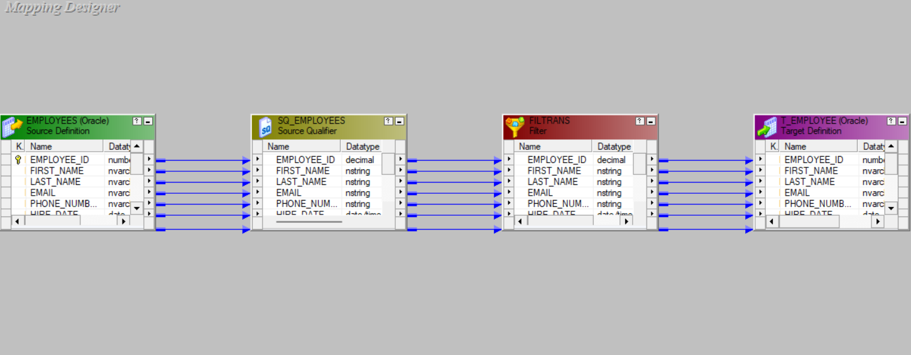

## Filter Transformation 

### Overview
- **What it is**: An active, row-by-row transformation that passes rows whose condition evaluates to TRUE and drops the rest.
- **Where it fits**: Anywhere in the pipeline after the source; often after `Expression`, `Lookup`, or `Joiner` when filtering on derived/lookup columns.
- **Why use it**: Reduce downstream rows when you can’t push the condition to the database or when the condition depends on results from earlier transformations.

### Key properties
- **Filter Condition**: Boolean expression using input ports, variables, and functions; supports AND/OR, parentheses, and parameters.
- **Tracing Level**: Controls session log verbosity (None, Terse, Normal, Verbose Initialization, Verbose Data).
- Processes streaming rows; no cache and non-blocking.

### Performance tips
- Place the `Filter` as early as logic allows to cut row volume.
- If the condition uses only source columns on a relational DB, prefer `Source Filter` in the `Source Qualifier` for better performance.
- Combine simple conditions into one filter when they target the same rows; use `Router` when you need multiple conditional outputs.

### Filter vs. Source Qualifier (SQ) filtering

| Aspect | Filter transformation | SQ filtering (e.g., Source Filter) |
|---|---|---|
| Where it runs | In the Integration Service (DTM) | In the database engine |
| Scope | Works after any upstream transformations and with any source type | Relational sources within the same SQ |
| Data moved | All rows reach the DTM, then filtered | Only qualifying rows leave the DB (less network/I/O) |
| Speed | Generally slower for large sets | Usually faster (uses DB optimizer/indexes) |
| Derived/lookup fields | Supported | Not supported (limited to source columns) |
| Extra features | Single pass/drop | Also supports `User Defined Join`, `Number Of Sorted Ports`, `Select Distinct` |

### When to choose which
- **Use SQ filtering** when: condition uses only source columns, source is relational, and you want DB-level performance.
- **Use Filter** when: condition depends on derived/lookup fields, source isn't relational, or logic isn't expressible in SQL.

---

### Project Screenshots

#### Designer View

#### Workflow Monitor Results

#### Database Results

