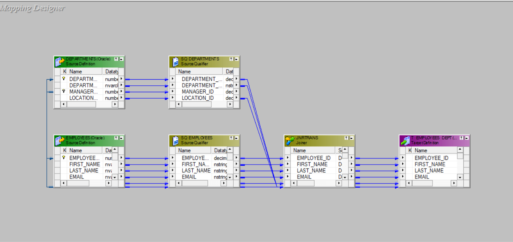

## Joiner Transformation 

### Overview
- **What it is**: Active, row-set transformation that joins two pipelines. Supports heterogeneous sources (different databases, flat files, etc.).
- **When to use**: You can't push the join into a single `Source Qualifier` (different connections) or you must join after upstream logic (e.g., after `Lookup`/`Expression`).

### Join types
- **Normal (Inner)**: Outputs only matching rows.
- **Master Outer**: Keeps all rows from the master; fills NULLs for unmatched detail.
- **Detail Outer**: Keeps all rows from the detail; fills NULLs for unmatched master.
- **Full Outer**: Keeps all rows from both sides.

### Core concepts
- **Master vs. Detail**: You choose which pipeline is master; Joiner typically caches the master first. Pick the smaller stream as master to reduce cache and speed up.
- **Join Condition**: One or more key pairs with =, <, >, <=, >=, !=; can use expressions/derived ports.
- **Sorted Input (option)**: If both inputs are sorted on the join keys, Joiner can use a merge-like stream with minimal caching.

### Key properties
- Join Type, Master Pipeline, Join Condition(s), Sorted Input, Tracing Level.

### Performance tips
- Prefer database join in `Source Qualifier` when both sources are in the same DB/connection.
- Make the smaller stream the master; filter early on both sides to shrink caches.
- Enable `Sorted Input` and sort both inputs on the join keys (via `Sorter` or DB `ORDER BY`).
- Align datatypes and formats on join keys to avoid implicit casts.
- Partition on join keys and co-partition streams when using session partitioning.

### Quick example
- Join daily `sales.csv` (detail) with `dim_customer` table (master) on `customer_id`.
- Set master to `dim_customer` (smaller), condition: `sales.customer_id = dim_customer.customer_id`, enable `Sorted Input` after sorting both inputs by `customer_id`.

### Joiner vs. Source Qualifier join
- **Joiner**: Runs in DTM, supports heterogeneous sources and post-transformation joins; may be semi-blocking with cache usage.
- **SQ (User Defined Join)**: Runs in the database, uses optimizer and indexes; usually faster when both sources share one connection.

---

### Project Screenshots

#### Designer View

#### Workflow Monitor Results

#### Database Results

